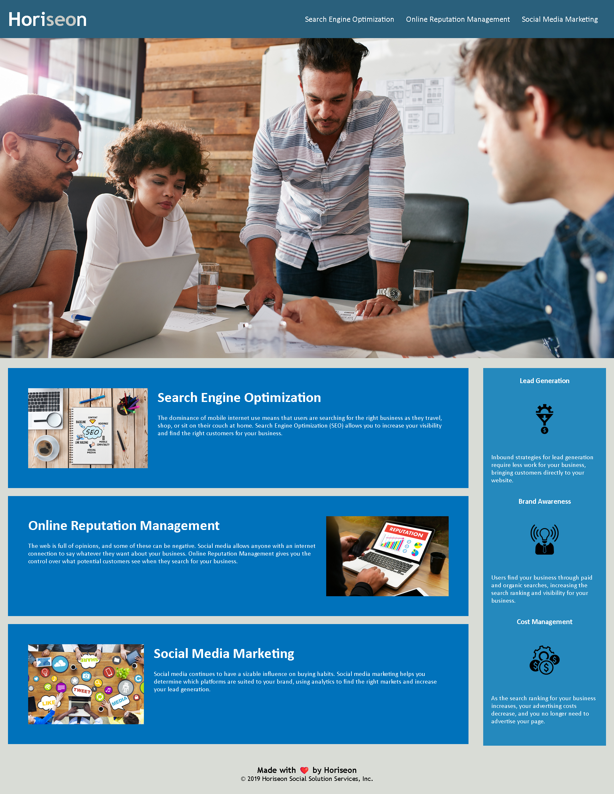

# Code Refactor for Horiseon Webpage

## Summary
The work done on this website is for the client Horiseon in order to better meet the needs of assistive technology users; something which has the double impact of increasing their visibility to search engines. Block elements of the website were replaced with semantic HTML elements, and images were given appropriate alt descriptions to better accommodate assistive technology users, improve Horiseons' web presence, and to help ensure ease of future development.

## Features

> **The work done solves these requirements by:**
>
>
> * Replacing generic HTML (mostly div elements) with semantic elements (ex. header, footer, aside, section, etc). 
 >
> * Updating the CSS stylesheet elements to match the changes made to the HTML.
>
> * Appropriate alt descriptions have been added to img elements, allowing for reader descriptions.
>
> * Comments have been made throughout the html and CSS pages to highlight the above changes. 

## Screenshot of Finished Webpage

## Acknowledgements
This is a project provided by
[© 2023 edX Boot Camps LLC. Confidential and Proprietary. All Rights Reserved.] and the work on it was performed by Will Riffe, a student of the Part-Time Course under instructor Scott Byers 2023.